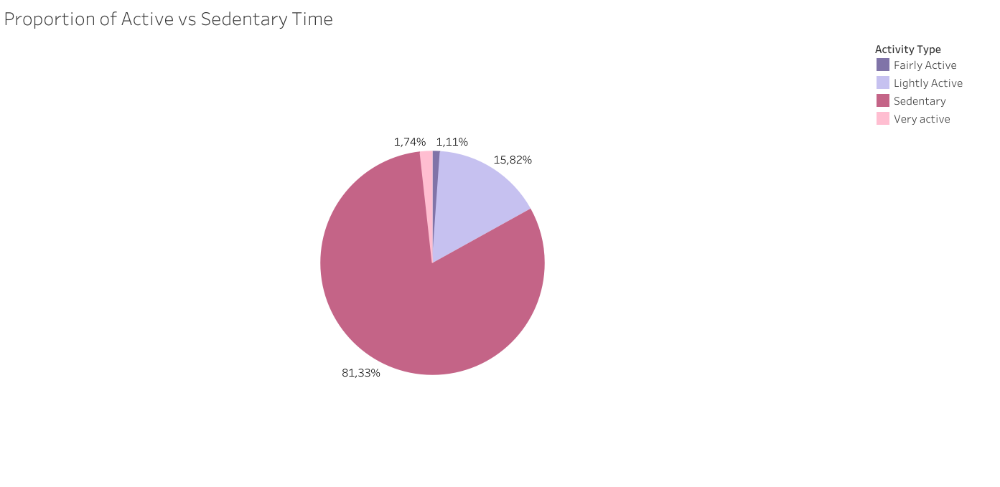
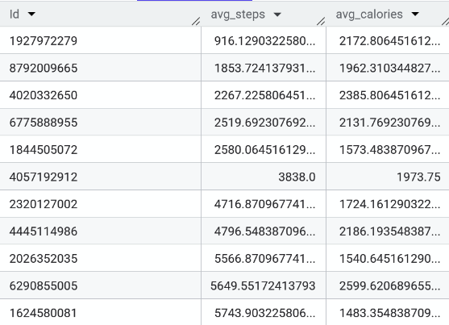

# Bella Beat Case Study
**Author:** Valentina Muñoz  
**Date:** _2025-09-25_  
---

## Background information
Urška Sršen and Sandro Mur founded **Bellabeat**, a high-tech company that manufactures health-focused smart products. By collecting data on activity, sleep, stress, and reproductive health, Bellabeat empowers women with knowledge about their own health and habits.  

## Business task
Sršen has requested an analysis of consumer data to identify opportunities for growth. The analysis will also focus on applying these insights to one specific Bellabeat product in order to support marketing strategy.  

The following questions will guide the analysis:  
1. What are the key trends in smart device usage?  
2. How could these trends apply to Bellabeat customers?  
3. How could these insights support Bellabeat’s marketing strategy?  

### Data sources

The dataset used for this case study comes from [FitBit Fitness Tracker Data](https://www.kaggle.com/datasets/arashnic/fitbit), a public domain dataset from Kaggle made available by Mobius. It contains personal fitness information from 30 Fitbit users over a two-month period in 2016. The dataset includes multiple CSV files with daily, hourly, and minute-level data. All users sampled consented to the submission of all personal tracker data contained in this dataset. 

**Important limitations**
- Small, non-representative sample of the overall population, therefore might not fully reflect broader consumer behavior.
- Data collected in 2016. May not reflect the most current device or user behavior trends.  
- Missing demographic information (notably **gender**), which limits inference for Bellabeat’s primary female customer segment.
- Since the data is publicly available through Kaggle, there are no licensing or privacy concerns, but it is important to acknowledge its open-source nature and limitations 
Despite these limitations, the dataset is suitable for exploring general patterns in activity and wellness that can inform Bellabeat’s strategic considerations.

## Quick verification 

Before proceeding with the analysis, I validated the number of unique users in each dataset by running the following query:

```sql
SELECT COUNT(DISTINCT Id) AS user_count
FROM `fitbit_data.daily_activity`;
```
Also ran a query to confirm the date range covered in each dataset:
```sql
SELECT MIN(ActivityDate) AS start_date, MAX(ActivityDate) AS end_date
FROM `fitbit_data.daily_activity`;
```
Results:

| Dataset        | Unique users | Date range             |
|----------------|--------------|------------------------|
| daily_activity | 33           | 2016-04-12 – 2016-05-12 |
| sleep_day      | 24           | 2016-04-12 – 2016-05-12 |
| hourly_steps   | 33           | 2016-04-12 – 2016-05-12 |

 *This shows that not all participants logged sleep data, which reduces the sample size available for sleep-related insights.*
 ## Data preparation
The analysis focused on three key tables: daily_activity, sleep_day, and hourly_steps. Data cleaning was conducted in BigQuery, including: 
- Removing duplicates (three records in the sleep_day table).
```sql
SELECT Id, SleepDay, 
COUNT(*) AS times
FROM `fitbit_data.sleep_day`
GROUP BY Id, SleepDay
HAVING COUNT(*) > 1;
```
- Parsing datetime fields to separate date and time for easier analysis.
```sql
CREATE OR REPLACE TABLE `fitbit_data.sleep_day_clean` AS
SELECT DISTINCT
  Id,
  DATE(PARSE_DATETIME('%m/%d/%Y %I:%M:%S %p', SleepDay)) AS SleepDate,
  TotalSleepRecords,
  TotalMinutesAsleep,
  TotalTimeInBed
FROM `fitbit_data.sleep_day`;
```
- Dropping unnecessary columns with mostly null or zero values.
```sql
CREATE OR REPLACE TABLE fitbit_data.daily_activity_clean AS
SELECT Id, 
ActivityDate,
TotalSteps,
TotalDistance, 
TrackerDistance,
VeryActiveDistance, 
ModeratelyActiveDistance, 
LightActiveDistance, 
VeryActiveMinutes, 
FairlyActiveMinutes,
LightlyActiveMinutes, 
SedentaryMinutes, 
Calories
 FROM `fitbit_data.daily_activity`;
```
- Reformatting the datetime field by splitting it into two separate columns.
```sql
CREATE OR REPLACE TABLE fitbit_data.hourly_steps_clean AS
SELECT Id, 
  DATE(PARSE_DATETIME('%m/%d/%Y %I:%M:%S %p', ActivityHour)) AS ActivityDate,
  TIME(PARSE_DATETIME('%m/%d/%Y %I:%M:%S %p', ActivityHour)) AS ActivityTime,
  StepTotal
FROM `fitbit_data.hourly_steps`
```  
- Creating cleaned tables:
  - daily_activity_clean
  - sleep_day_clean
  - hourly_steps_clean
    
These cleaned datasets formed the foundation for the analysis.

## Analysis and key findings 
To identify trends in user activity that may inform Bellabeat’s product strategy, the analysis was structured into four areas: activity levels, calorie expenditure, sleep patterns, and relationships between behaviors. 

To evaluate physical activity, I first calculated the average daily steps per user: 
```sql
SELECT Id,
ROUND(AVG(StepTotal), 2) AS StepsAVG
FROM `fitbit_data.hourly_steps_clean`
GROUP BY Id;
```
Out of 33 participants, only one consistently reached the widely recommended benchmark of 10,000 steps per day. This indicates that most participants are not meeting physical activity guidelines, suggesting sedentary lifestyles. 

When analyzing activity minutes by category (sedentary, lightly active, fairly active, very active), the results show that sedentary time dominates the day, with active minutes forming only a small fraction of total time.



This supports the finding from step counts that overall physical activity is low.

Analysis of average steps and calories burned per user revealed a positive relationship: higher step counts are consistently associated with greater calorie expenditure
```sql
SELECT 
  Id,
  AVG(TotalSteps) AS avg_steps,
  AVG(Calories) AS avg_calories
FROM `fitbit_data.daily_activity_clean`
GROUP BY Id;
```


This aligns with expectations and validates the dataset’s reliability.

Hourly trends show that physical activity peaks around 6 PM, indicating that evenings are the most active period for users. 
```sql
SELECT
  EXTRACT(HOUR FROM ActivityTime) AS hour_of_day,
  AVG(StepTotal) AS avg_steps
FROM `fitbit_data.hourly_steps_clean`
GROUP BY hour_of_day
ORDER BY avg_steps DESC
LIMIT 1;
```
 

Weekly patterns reveal that Tuesdays and Saturdays are the most active days, while Sundays are the least active.
```sql
WITH daily_totals AS (
  SELECT
    Id,
    DATE(ActivityDate) AS activity_date,
    SUM(StepTotal) AS steps_per_day
  FROM `fitbit_data.hourly_steps_clean`
  GROUP BY Id, activity_date
)
SELECT
  EXTRACT(DAYOFWEEK FROM activity_date) AS day_num,
  FORMAT_DATE('%A', activity_date) AS day_name,
  ROUND(AVG(steps_per_day), 0) AS avg_steps
FROM daily_totals
GROUP BY day_num, day_name
ORDER BY day_num;
```
 

On average, users sleep between 6–7 hours per night, which meets minimum health guidelines but falls short of the optimal 8 hours.
```sql
SELECT  Id, 
AVG(TotalMinutesAsleep) / 60 AS hours_asleep
FROM `bellabeat-analysis-472517.fitbit_data.sleep_day_clean` 
GROUP BY Id; 
```


Sleep efficiency (percentage of time in bed actually spent sleeping) is high across the dataset, averaging above 90%. This indicates that participants generally sleep soundly once in bed, but total sleep duration remains insufficient.
```sql
SELECT Id, 
  AVG(TotalMinutesAsleep)/60 AS avg_sleep_time_hour,
  AVG(TotalTimeInBed)/60 AS avg_time_bed_hour,
  AVG(TotalTimeInBed - TotalMinutesAsleep) AS wasted_bed_time_min, 
  ROUND(SUM(TotalMinutesAsleep) * 100 / SUM(TotalTimeInBed),2) AS sleep_efficiency
FROM `fitbit_data.sleep_day_clean`
GROUP BY Id
```

To explore cross-behavior patterns, I examined the relationship between total sleep and calories burned. Results suggest that users with higher total sleep minutes also show higher calorie expenditure. Conversely, participants with very limited sleep logged significantly fewer calories burned.
```sql
SELECT
  daily.Id, 
  SUM(TotalMinutesAsleep) AS total_sleep_min,
  SUM(TotalTimeInBed) AS total_time_inbed_min,
  SUM(Calories) AS calories
FROM `fitbit_data.daily_activity_clean` AS daily
INNER JOIN `fitbit_data.sleep_day_clean` AS sleep
ON daily.Id = sleep.Id AND daily.ActivityDate = sleep.SleepDate
GROUP BY daily.Id; 
```
## Recommendations: 

- Low daily step counts and high sedentary time indicate an opportunity for Bellabeat to design features that encourage movement throughout the day: personalized reminders, activity challenges, or progress streaks to motivate users to break up sedentary behavior. Campaigns or group challenges could be strategically promoted during peak engagement times (Tuesday evenings or Saturday mornings).
- While sleep efficiency is strong, average duration falls short of optimal guidelines. Bellabeat could emphasize sleep-tracking features promote longer rest, such as bedtime reminders or relaxation content.
- The data suggests insufficient rest reduces daily energy levels and movement. Bellabeat can highlight this by providing integrated recommendations like calorie-burn challenges linked to sleep consistency.
- To further motivate users to live more active lifestyles while strengthening product engagement, Bellabeat can set up daily or weekly calorie and movement challenges that reward users with points or discounts for other Bellabeat products/services. 
